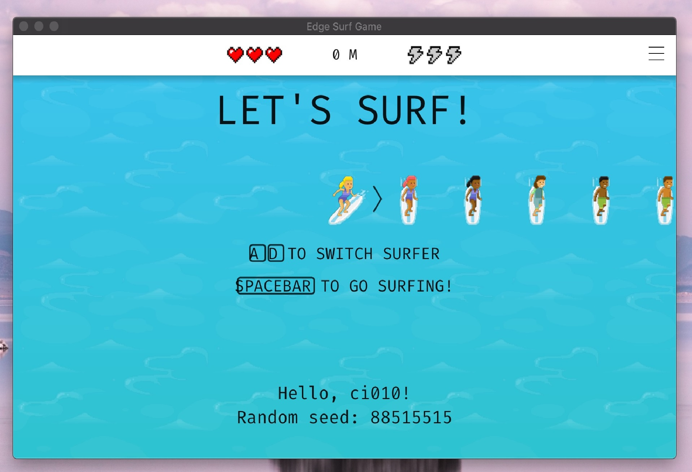

# Edge Surf Game

The [surf](edge://surf) game in Edge browser, but written by pure C.

## Screenshot



## Download

[Release](https://github.com/ShirasawaSama/edge-surf-game/releases)

## Requirement

- [Premake5](https://premake.github.io/)
- [GLFW](https://github.com/glfw/glfw)
- [GLEW](https://github.com/nigels-com/glew) _(only Windows and Linux)_

## Build

### Windows

```bash
git clone https://github.com/ShirasawaSama/edge-surf-game.git

cd edge-surf-game

vcpkg install glfw3:x64-windows-static glew:x64-windows-static

premake5 vs2019
```

### Linux

```bash
git clone https://github.com/ShirasawaSama/edge-surf-game.git

cd edge-surf-game

sudo apt-get install build-essential libglfw3-dev libglew-dev pkg-config

premake5 gmake

cd build && make edge-surf-game config=release_x64
```

### MacOS

```bash
git clone https://github.com/ShirasawaSama/edge-surf-game.git

cd edge-surf-game

brew install glfw3 pkg-config

premake5 gmake

cd build && make edge-surf-game config=release_x64
```

## Author

Shirasawa

## License

[MIT](LICENSE)

The copyright of the pictures in the `src/images` belongs to Microsoft.

These pictures are used **illegally** in this project.

Font file: [Fira Code](https://github.com/tonsky/FiraCode)

Background music: Dan Gibson - By the Grace of the Sea
